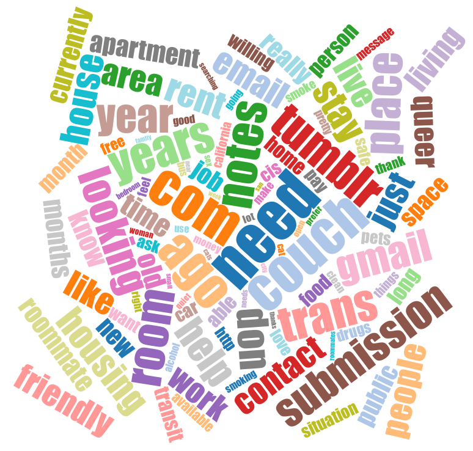

================================

Description
-----------

Find a more effective way for queer, trans, and gender-non-conforming individuals to connect and share safe housing.

Requirements
------------

-   NPM
-   Ruby Sass
-   MongoDB

Stack
-----

- Node/Express
- Mongo
- React
- Redux
- Material Design

Install
-------

```bash
$ cd server && npm install
$ cd ../public && npm install
$ open http://localhost:9000
```

Research
--------

-   Our team reached out to friends within our social networks to listen to
    personal stories of real people that have experienced problems finding
    housing.

-   We analyzed postings from both http://www.transhousingnetwork.com/ &
    http://queerhousing.tumblr.com/ to find out what real people are looking
    for. This was done subjectively as well as objectively. For the latter we
    used an algorithm called TextRank to look for the most important keywords
    from the entire collection of posts from these pages. Here are the results
    presented as a word cloud:



-   With all of our background information we constructed empathy maps of both
    an individual looking for housing ("Quinn") as well as an individual looking
    to share ("Hannah"). From this we built personas.


Roadmap
----------

-   Interviews, viability testing — what’s really important (feedback, baby!)
-   Communication in app vs external?
